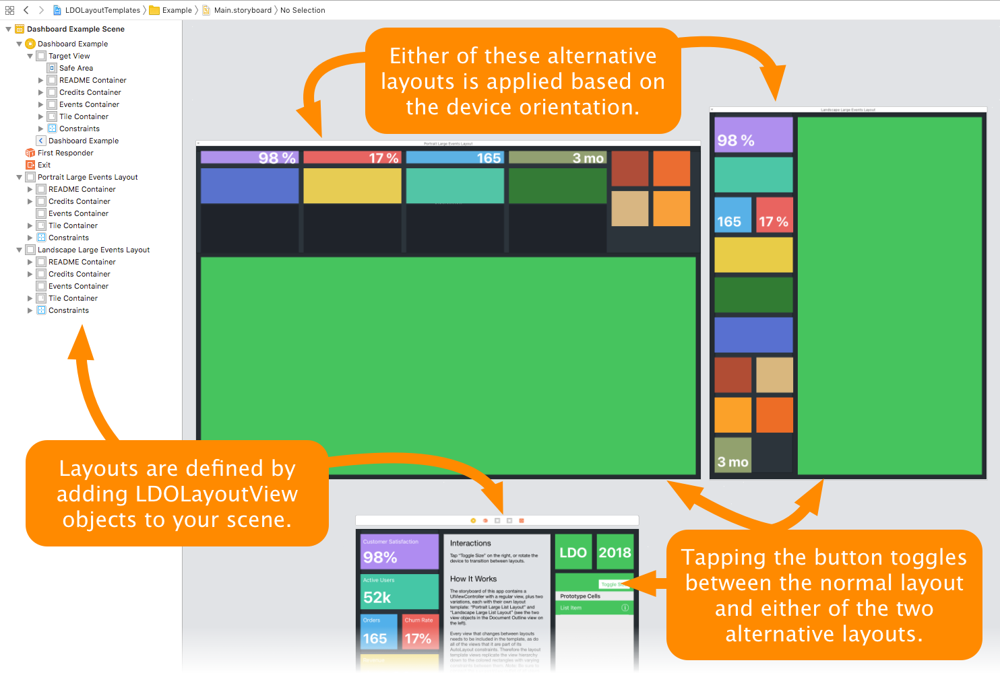

# LDOLayoutTemplates

Design multiple layouts of the same view in Interface Builder, and easily transition between them.

[](https://cocoapods.org/pods/LDOLayoutTemplates)
[](https://cocoapods.org/pods/LDOLayoutTemplates)
[](https://cocoapods.org/pods/LDOLayoutTemplates)

**LDOLayoutTemplates lets you achieve this…**


**…with very little code:**

```swift
class DashboardViewController: UIViewController {
    @IBOutlet weak var portraitLargeListLayout: LDOLayoutTemplate!
    @IBOutlet weak var landscapeLargeListLayout: LDOLayoutTemplate!
    private var defaultLayout: LDOLayoutTemplate!
    private var largeListLayoutActive = false
    
    override func viewDidLoad() {
        super.viewDidLoad()
        
        // Create a backup of the initial view contents for later restoration.
        defaultLayout = LDOLayoutTemplate(withCurrentStateForViewsIn: portraitLargeListLayout)
    }
    
    override func viewWillTransition(to size: CGSize, with coordinator: UIViewControllerTransitionCoordinator) {
        super.viewWillTransition(to: size, with: coordinator)
        
        coordinator.animate(alongsideTransition: { _ in
            self.applyLayout(for: size)
        })
    }
    
    @IBAction func toggleLargeListLayout() {
        largeListLayoutActive.toggle()
        
        view.layoutIfNeeded()
        UIView.animate(withDuration: 0.3) {
            self.applyLayout(for: self.view.bounds.size)
        }
    }
    
    private func applyLayout(for size: CGSize) {
        if largeListLayoutActive {
            if size.width > size.height {
                landscapeLargeListLayout.apply()
            } else {
                portraitLargeListLayout.apply()
            }
        } else {
            defaultLayout.apply()
        }
        view.layoutIfNeeded()
    }
}
```

The different constraints and attributes of each view are defined by three views in the storyboard:



## Motivation

We love visually creating our views in Interface Builder.
However, if a screen layout differs between orientations, or if a view has two modes (e.g. large and collapsed modes), setting up constraints and managing them in code quickly turns into a mess.
Things only get worse if you have more than two variations.

Wouldn't it be nice to design each layout separately, with an easy way to transition from one to another? 

## Example

To run the example project, clone the repo, open the workspace in the `Example` folder, and click Run.
Alternatively, you can use `pod try https://github.com/lurado/LDOLayoutTemplates`. 

The dashboard example shown above is only available on iPad.

## How To

1. In a storyboard, lay out your view controller's view as usual — let's assume this will be used in landscape orientation.
1. Drag a *View* object from the library onto your view controller scene in the left sidebar, outside of its view hierarchy.
    Change its *Custom Class* to `LDOLayoutTemplate` in the right sidebar.
    
    This is your layout template in which you design the variation (e.g. portrait orientation).
    This view will never be shown to the user, but its constraints (and attributes, see below) will be transferred to the main view.
1. Change the size of your template view to portrait dimensions (not really necessary, but it makes designing it easier).
1. Copy or re-create the views whose constraints change between layouts from the view controller's view to the template view.
    If you copy your views, make sure to disconnect any outlets.
1. Modify the constraints as needed.
1. Connect the `targetView` outlet of each template view to its corresponding view in the view controller's view.
    It is important that every template view participating in a constraint has this outlet connected.
1. Add and connect an outlet for the `LDOLayoutTemplate` to your view controller.
1. Call `apply` on the template to switch to this layout, for example on orientation change. 
    If you want to animate the transition, wrap the call to `apply` in an `UIView` animation block.
1. If you plan to switch back to your original layout, create another instance of `LDOLayoutTemplate` (typically in `viewDidLoad`, as shown in the example code above).
    Initialize this layout using `LDOLayoutTemplate.init(withCurrentStateForViewsIn:)`, which creates an `LDOLayoutTemplate` based on the current view configuration.
    Call `apply` on this template to restore the initial state of the view.
1. Setup as many templates as you need, and happily switch between them.

## Attribute Changes

By default, `LDOLayoutTemplate` only copies Auto Layout constraints from one view to another.
You can also transfer attributes from each view in a template to its `targetView` by either adding a comma separated list of attributes to *Template Attributes* in the Attribute Inspector in Interface Builder,
or by overriding `transferredTemplateAttributeKeyPaths` in your `UIView` subclass.

## Limitations

Layout guides such as the Safe Area are not supported.
Use helper views anchored to the layout guide instead.

## Installation

LDOLayoutTemplates is available through [CocoaPods](https://cocoapods.org).
To install it, add the following line to your Podfile:

```ruby
pod "LDOLayoutTemplates"
```

## How Does It Work?

This library is actually quite simple, and uses the following approach:

- Iterate over all views of a template and collect all constraints between views with a target view.
  These are the constraints that will be _activated_ when `apply` is called.
- Iterate over all the target views (the ones in your view controller's view having a `targetView` outlet 
    pointing at them), and collect all constraints between them.
  These constraints will be _deactivated_ when `apply` is called.
- The algorithm considers all constraints that are either set up *between* two views with a target view, or which define  width and height constraints for a view with a target view.

## Author

Raschke & Ludwig GbR, https://www.lurado.com/

## License

LDOLayoutTemplates is available under the MIT license.
See the LICENSE file for more information.
